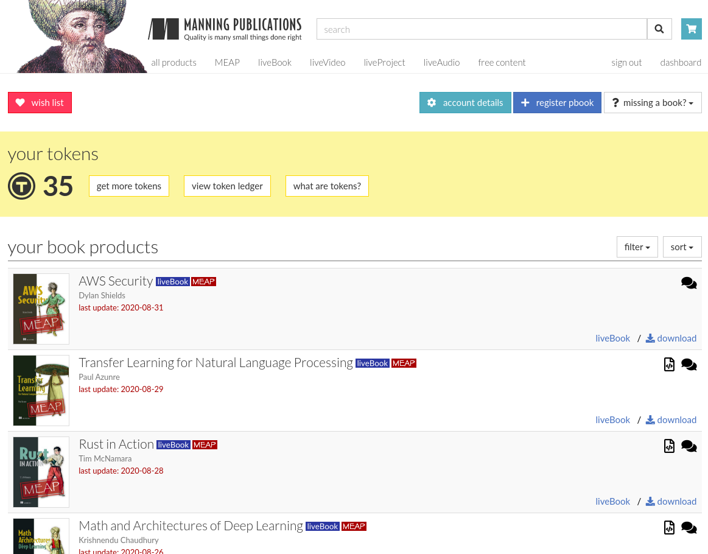

# Manning Publications Ebooks Downloader

[](https://github.com/luckylittle/Manning-Publications-Ebooks-Downloader/blob/master/LICENSE)

If you are like me and you have bought a lot of (50+) ebooks from [Manning Publications](https://www.manning.com/), you might be looking for a tool that can programatically download them in a nice, organized way. You came to the right place!

Screenshot of the owned products dashboard:



## Usage

```bash
./manning.py -h
# Usage: `manning.py -u <email> -p <password>`

./manning.py -u user@domain.com -p secretpassword
# Created folder Manning_2020-09-13
# Created folder Manning_2020-09-13/AWS_Security
# Created folder Manning_2020-09-13/Transfer_Learning_for_Natural_Language_Processing
# Created folder Manning_2020-09-13/Rust_in_Action
# Created folder Manning_2020-09-13/Math_and_Architectures_of_Deep_Learning
# Created folder Manning_2020-09-13/Learn_Kubernetes_in_a_Month_of_Lunches
# ...
```

## Result

```bash
tree Manning_2020-09-13
# Manning_2020-09-13
# ├── AWS_Security
# │   └── AWS_Security.zip
# ├── Azure_Storage,_Streaming,_and_Batch_Analytics
# │   └── Azure_Storage,_Streaming,_and_Batch_Analytics.zip
# ├── Beyond_Spreadsheets_with_R
# │   └── Beyond_Spreadsheets_with_R.zip
# ├── Elastic_Leadership
# │   └── Elastic_Leadership.zip
# ├── Event_Streams_in_Action
# │   └── Event_Streams_in_Action.zip
# ├── Five_Lines_of_Code
# │   └── Five_Lines_of_Code.zip
# ...
```

* Each `*.zip` file contains `PDF`, `EPUB`, `MOBI`:

```bash
zipinfo Manning_2020-09-13/AWS_Security/AWS_Security.zip
# Archive:  AWS_Security.zip
# Zip file size: 14443760 bytes, number of entries: 3
# -rw----     2.0 fat  8008077 bl defN 20-Sep-13 06:36 AWS_Security_v3_MEAP.pdf
# -rw----     2.0 fat  4457182 bl defN 20-Sep-13 06:36 AWS_Security_v3_MEAP.epub
# -rw----     2.0 fat  3016348 bl defN 20-Sep-13 06:36 AWS_Security_v3_MEAP.mobi
#  files, 15481607 bytes uncompressed, 14443314 bytes compressed:  6.7%
```

## Requirements

Tested on:

```bash
uname -a
# Linux lmaly.remote.csb 4.18.0-80.11.2.el8_0.x86_64 #1 SMP Sun Sep 15 11:24:21 UTC 2019 x86_64 x86_64 x86_64 GNU/Linux

python --version
# Python 3.6.8
```

## Stars

[](https://starchart.cc/luckylittle/Manning-Publications-Ebooks-Downloader)

## Contributors

Lucian Maly <<lucian@redhat.com>>

---

_Last Update: Sun Sep 13 10:48:32 UTC 2020_
